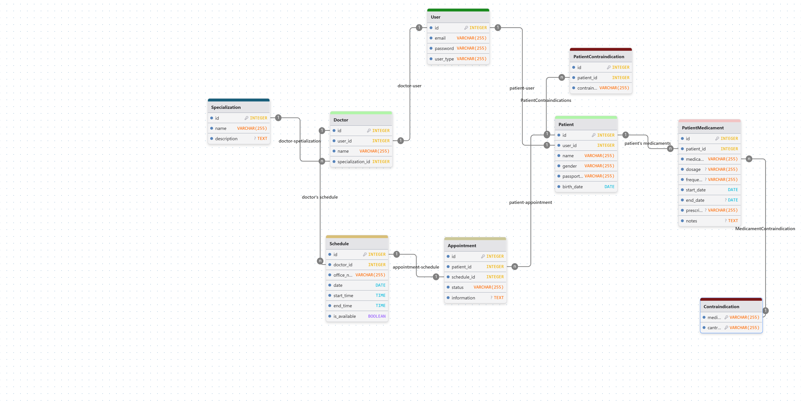

# Health-Sphere
# Описание

Современная медицинская информационная система, предназначенная для автоматизации работы поликлиники и улучшения взаимодействия между пациентами и медицинским персоналом. Система обеспечивает хранение медицинских данных, управление расписанием врачей, запись пациентов на приём и контроль назначений.

## Наименование

**Health-Sphere - медицинская информационная система для поликлиники**

## Предметная область

Предметной областью системы является организация и поддержка процессов медицинского обслуживания в поликлинике, включая регистрацию пользователей, ведение данных пациентов и врачей, планирование приёмов, учёт и контроль медицинских назначений и противопоказаний.

# Данные

В системе используются следующие основные сущности данных:
- Пользователи системы
- Пациенты
- Врачи

- Специализации врачей

- Расписания врачей
- Записи на приём

- Назначенные пациентам лекарства
- Противопоказания



## Для каждого элемента данных — ограничения

**Пользователь (User)**  
Email уникален и обязателен, пароль обязателен, тип пользователя строго определён (пациент или врач или админ). Дата создания устанавливается автоматически.

**Пациент (Patient)**  
ФИО обязательны и должны соответствовать формату имени. Пол ограничен допустимыми значениями. Паспорт, страховой номер, телефон и email уникальны. Телефон содержит только цифры. Дата рождения обязательна. Связь с USER уникальна.

**Врач (Doctor)**  
ФИО обязательны и форматируются. Телефон и email уникальны. Специализация обязательна. Связь с пользователем уникальна.

**Специализация (Specialization)**  
Наименование уникально и обязательно.

**Расписание (Schedule)**  
Дата не может быть меньше текущей. Время окончания приёма должно быть больше времени начала. Привязка к врачу обязательна.

**Запись на приём (Appointment)**  
Пациент и расписание обязательны. Статус записи ограничен допустимыми значениями (запланирован, завершён, отменён).

**Назначенные лекарства (PatientMedicament)**  
Название лекарства ограничено по длине. Дата окончания не может быть раньше даты начала. Привязка к пациенту обязательна. Ограничения на пересечения противопоказаний и назначенных лекарств.

**Противопоказания пациента (PatientContradiction)**  
Привязка к пациенту обязательна. Значение противопоказания не может быть пустым.

## Общие ограничения целостности

В системе обеспечивается ссылочная целостность через внешние ключи. Используются уникальные ограничения для предотвращения дублирования данных. Реализованы каскадные удаления зависимых записей. Контролируется корректность форматов данных и допустимость значений.
Дополнительная проверка с помощью средств python и orm

# Пользовательские роли

## Пациент

**Ответственность:** поиск врачей,запись на приём, просмотр своих личных данных, истории посещений, назначений и противопоказаний.  
**Количество пользователей:** не ограничено.

## Врач

**Ответственность:** просмотр расписания, работа с записями пациентов, оформление приёмов, назначение лекарств и противопоказаний.  
**Количество пользователей:** не ограничено.

## Администратор

**Ответственность:** управление пользователями, специализациями, контроль корректности данных и работы системы.  
**Количество пользователей:** 1 .

# UI / API

Система предоставляет REST API для взаимодействия клиентских приложений с сервером. Пользовательский интерфейс может быть реализован в виде веб-приложения с авторизацией и ролевым доступом.

# Технологии разработки

## Язык программирования

Python(fastAPI,uvicorn,pydantic,sqlAlchemy),
Vue, JavaScript, CSS

## СУБД

PostgreSQL

# Тестирование

postman, fastapi docs

Тестирование системы включает модульные тесты бизнес-логики, тесты API, проверку ограничений целостности базы данных, а также интеграционное тестирование основных пользовательских сценариев.

# Запуск и развёртывание сервера

Серверная часть проекта **Health Sphere** реализована на Python с использованием фреймворка FastAPI и запускается с помощью ASGI-сервера **Uvicorn**. Для хранения данных используется СУБД **PostgreSQL**. Конфигурация приложения осуществляется через переменные окружения, загружаемые из файла `.env`.

## Требования к окружению

Для запуска приложения необходимо:
- Python версии **3.10 или выше**;
- установленная и запущенная **PostgreSQL**;
- менеджер пакетов `pip`;

## Настройка переменных окружения

Все параметры подключения к базе данных и настройки приложения задаются через файл `.env`.

Пример файла `.env`:

```env
DATABASE_HOSTNAME=localhost
DATABASE_PORT=5432
DATABASE_NAME=health_sphere
DATABASE_USERNAME=health_user
DATABASE_PASSWORD=password
```

Файл `.env` должен находиться в корне проекта(project) и не добавляться в систему контроля версий. Загрузка и доступ к переменным окружения осуществляется через модуль `settings`.

## Настройка базы данных PostgreSQL

Перед запуском приложения необходимо создать базу данных:

```sql
CREATE DATABASE health_sphere;
```

При необходимости создаётся пользователь и выдаются права доступа:

```sql
CREATE USER health_user WITH PASSWORD 'password';
GRANT ALL PRIVILEGES ON DATABASE health_sphere TO health_user;
```

## Установка зависимостей

1. Создать и активировать виртуальное окружение:

```bash
python -m venv venv
source venv/bin/activate      # Linux / macOS
venv\Scripts\activate         # Windows
```

2. Установить зависимости проекта:

```bash
pip install -r requirements.txt
```

## Инициализация и миграции базы данных

Для управления структурой базы данных используется инструмент **Alembic**. Все изменения схемы базы данных оформляются в виде миграций.

Перед первым запуском приложения необходимо применить актуальные миграции:

```bash
alembic upgrade head
```

Данная команда создаёт все необходимые таблицы и ограничения в базе данных PostgreSQL в соответствии с текущим состоянием ORM-моделей.

Данная команда так же создаст пользователя админ
username:admin@mail.ru
password:12345678


## Запуск приложения

Запуск сервера осуществляется с помощью ASGI-сервера **Uvicorn**:

```bash
uvicorn main:app --reload
```

После запуска приложение доступно по адресу:

```
http://127.0.0.1:8000
```

## Документация API

Автоматически сгенерированная документация REST API доступна по адресy:

`http://127.0.0.1:8000/docs`
